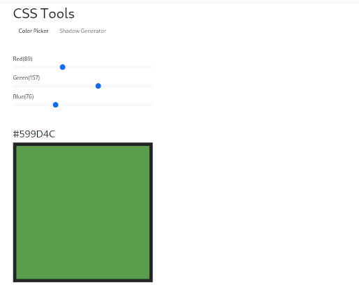
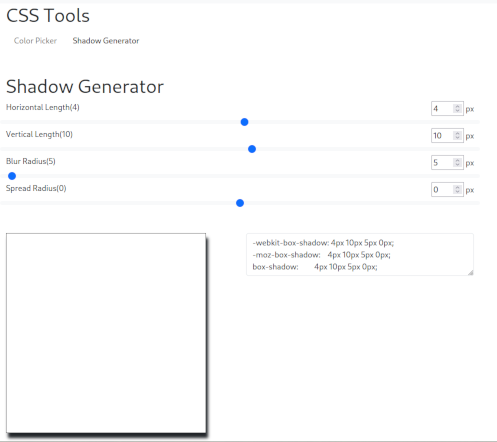
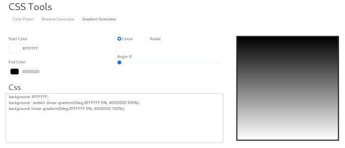

# svelte-gallery
svelte-gallery is an interactive gallery of small utilities I have made 
for learning Svelte and SvelteKit. 

## Application Sections
### Home
The Home section provides an overview of the available sections within the 
application.

### CSS Tools
CSS Tools is a collection of utilities for working with CSS.

#### Color Picker


The Color Picker tool allows users to select colors and view their 
corresponding HTML color codes.

#### Shadow Generator


The Shadow Generator tool enables users to visually design box shadows 
and obtain the corresponding CSS code. 

### Gradient Generator


The Gradient Generator tool enables users to visually design a gradient and 
obtain the corresponding CSS code.

## Getting Started
To run svelte-gallery locally, clone the repository and follow these steps:

1. Install the dependencies:

   ```bash
   npm install
   ```
2. Start the development server:
   ```bash
    npm run dev
   ```
   
The application will be available at http://localhost:5174.
